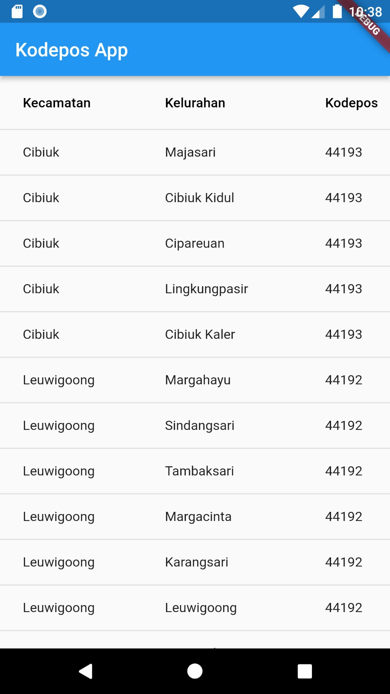

# UAS Pemograman Mobile: uas_API (Kode Pos)

<strong>Repository ini dibuat untuk memenuhi tugas Pemrograman Mobile</strong>
| <strong>Nama</strong>      | <strong>Riris Naomi Gurning</strong>  |
| ----------- | ----------- |
| <strong>NIM</strong>     | <strong>312010190</strong>       |
| <strong>Kelas</strong>   | <strong>TI.20.A.1</strong>        |

 Aplikasi ini merupakan aplikasi mobile yang menggunakan framework flutter dengan menggambil data dari sebuah API, dimana aplikasi ini memudahkan pengguna menemukan kode pos dari sebuah kecamatan dan kelurahan 

<strong>Dibawah ini terdapat hasil aplikasi mobile tentang kode pos:</strong>

<strong>Dibawah ini merupakan Link API yang saya pakai:

[LINK LOKAL 1](https://github.com/farizdotid/DAFTAR-API-LOKAL-INDONESIA#hiburan) DAN [LINK 2](https://github.com/bachors/apiapi#kode-pos-api)
 [LINK JSON API](https://kodepos-2d475.firebaseio.com/kota_kab/k69.json?print=pretty) 

 <strong>Aplikasi Mobile ini terdapat sebuah atribut sebagai berikut </strong>

1. title pada MaterialApp: Atribut ini digunakan untuk memberikan judul pada aplikasi Flutter.

2. primarySwatch pada ThemeData: Atribut ini digunakan untuk mengatur skema warna primer dalam tema aplikasi.

3. data pada _KodeposScreenState: Variabel ini merupakan List<<b>dynamic</b>> yang digunakan untuk menyimpan data yang diambil dari API.

4. isLoading pada _KodeposScreenState: Variabel ini merupakan boolean yang menunjukkan apakah data sedang dalam proses pengambilan atau tidak.

 Selain itu, terdapat juga beberapa widget yang menggunakan properti atau atribut sebagai berikut: 

1. Scaffold: Widget ini memiliki beberapa atribut seperti appBar untuk mengatur tampilan App Bar, dan body untuk mengatur tampilan konten utama aplikasi.
2. AppBar: Widget ini memiliki atribut title untuk mengatur judul yang ditampilkan pada App Bar.
3. Center: Widget ini memiliki atribut child yang digunakan untuk menempatkan widget lain di tengah-tengah.
4. CircularProgressIndicator: Widget ini digunakan untuk menampilkan indikator loading sirkular saat data sedang diambil.

5. DataTable: Widget ini digunakan untuk menampilkan data dalam format tabel. Widget ini memiliki atribut columns untuk mengatur kolom-kolom yang akan ditampilkan, dan rows untuk mengatur baris-baris data yang akan ditampilkan.

6. DataColumn: Widget ini digunakan untuk mengatur tampilan kolom dalam tabel. Widget ini memiliki atribut label untuk mengatur teks yang akan ditampilkan sebagai label kolom.

7. DataRow: Widget ini digunakan untuk mengatur tampilan baris dalam tabel. Widget ini memiliki atribut cells untuk mengatur sel-sel data dalam baris tersebut.
 8. DataCell: Widget ini digunakan untuk mengatur tampilan sel data dalam tabel. Widget ini memiliki atribut child untuk mengatur tampilan isi sel data. 

<strong>Selain itu, dalam kode tersebut juga digunakan package/package import yang berfungsi untuk mengimpor library eksternal yang diperlukan dalam pengembangan aplikasi Flutter. Dalam contoh tersebut, digunakan package flutter/material.dart untuk mengimpor komponen-komponen UI dari Flutter, dan package http untuk melakukan permintaan HTTP ke API.</strong>
